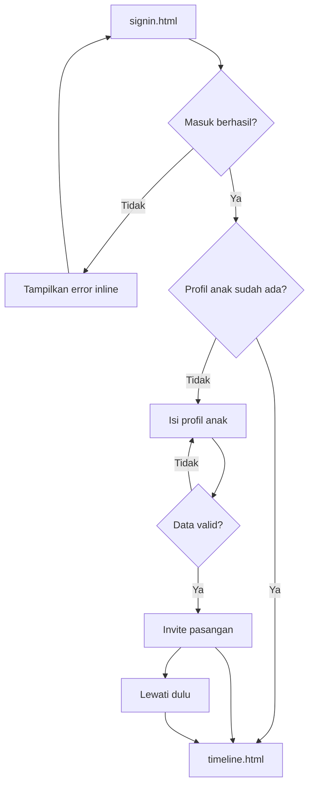

# 03 User Flows

## Flow utama: pengguna baru sampai timeline

### Acceptance criteria

- Refresh pada tiap layar tidak menghapus fixture sampai tombol reset prototype dipakai.
- Error tidak menghilangkan input yang sudah benar.
- Pengguna selalu memiliki jalan keluar menuju timeline tanpa harus menunggu pasangan menerima undangan.

## Flow membuat cerita tanpa foto

1. Dari timeline, pengguna menekan `Tulis cerita` atau composer prompt.
2. Form terbuka dengan tanggal hari ini dan type `Cerita harian`.
3. Pengguna mengisi isi cerita. Judul boleh kosong.
4. Pengguna menekan `Simpan cerita`.
5. Prototype memvalidasi isi, menulis data ke localStorage, lalu mengarahkan ke detail entri.
6. Timeline menampilkan entri baru pada posisi tanggal yang benar.

**Failure:** bila isi kosong, fokus kembali ke textarea dan tampilkan `Tulis sedikit cerita sebelum disimpan.`

## Flow membuat milestone dengan foto

1. Pengguna memilih type `Milestone`.
2. Pengguna mengisi judul dan cerita.
3. Pengguna memilih satu sampai enam file gambar dari picker mock.
4. Setiap thumbnail memiliki status `ready`, `uploading`, `uploaded`, atau `error`.
5. Pengguna dapat menghapus atau mengubah urutan thumbnail.
6. Saat simpan, teks disimpan terlebih dahulu. Foto diproses setelah reservasi kuota berhasil.
7. Bila semua foto berhasil, detail menampilkan gallery.
8. Bila sebagian gagal, detail menampilkan cerita dan status foto gagal dengan action retry.

## Flow undang pasangan

1. Dari onboarding atau settings, pengguna membuka `Undang pasangan`.
2. Pengguna mengisi email pasangan.
3. Prototype menampilkan state loading singkat, lalu success state `Undangan sudah disiapkan`.
4. Pengguna dapat kembali ke timeline. Penerimaan undangan nyata masuk P1 dengan token sekali pakai.

## Flow storage penuh

1. Pengguna membuka form ketika `usedBytes >= quotaBytes`.
2. Photo picker tetap terlihat tetapi action upload baru berstatus disabled.
3. Banner menjelaskan `Penyimpanan foto penuh` dan menyediakan `Export foto`.
4. Pengguna memilih `Simpan tanpa foto`.
5. Entri teks berhasil dibuat dengan `photoStatus=skipped_due_to_quota`.

## Flow edit dan hapus

- `Edit cerita` membuka form yang sudah terisi dan mempertahankan urutan foto.
- `Simpan perubahan` memperbarui `updatedAt` tanpa mengubah `createdAt`.
- `Hapus cerita` harus membuka confirmation dialog dengan pilihan `Batal` dan `Hapus cerita`.
- Setelah hapus, pengguna kembali ke timeline. Bila tidak ada entri, tampilkan empty state.

## Flow export foto mock

1. Pengguna menekan `Export foto` di settings atau storage full state.
2. Prototype menampilkan status `Menyiapkan export`.
3. Setelah delay singkat, status berubah menjadi `Export siap diunduh` tanpa benar-benar mengirim file ke server.
4. Implementasi VPS P1 harus membuat job asynchronous, menyimpan manifest, dan memberikan link download privat yang kadaluarsa.
