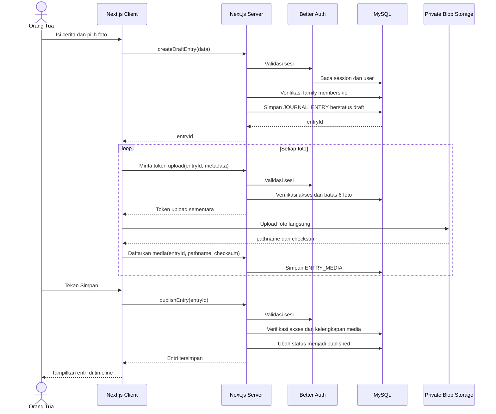
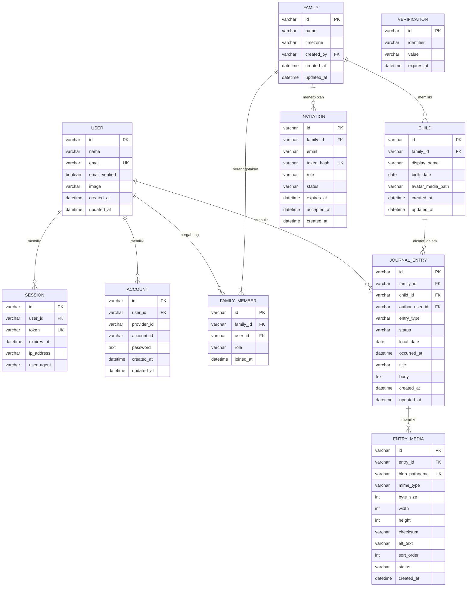

# PRD — Jurnal Milestone Anak

## 1. Overview

### Ringkasan produk

Aplikasi web privat untuk membantu dua orang tua mencatat cerita, foto, dan milestone harian anak dalam satu timeline bersama. Pengalaman utama harus terasa seperti menulis pesan singkat: cepat, nyaman di ponsel, dan dapat diselesaikan dalam waktu kurang dari 60 detik.

### Masalah utama

- Momen kecil anak mudah terlupakan atau tercecer di galeri, chat, dan media sosial.
- Kedua orang tua tidak memiliki satu arsip bersama yang terstruktur.
- Aplikasi journaling umum terlalu kompleks atau tidak dirancang untuk dokumentasi anak.
- Foto anak merupakan data sensitif sehingga tidak boleh dapat diakses publik.

### Target pengguna

- Orang tua baru dengan satu atau lebih anak.
- Dua orang tua yang ingin mengelola jurnal keluarga bersama.
- Pengguna nonteknis yang mayoritas mengakses aplikasi dari ponsel.

### Sasaran MVP

Dalam satu minggu, MVP harus memungkinkan pengguna:

1. Membuat akun dan ruang keluarga privat.
2. Mengundang pasangan.
3. Menambahkan profil anak.
4. Menulis cerita harian atau milestone.
5. Menambahkan maksimal enam foto per entri.
6. Melihat entri dalam timeline.
7. Mengedit dan menghapus entri milik keluarga.
8. Mengekspor seluruh jurnal agar data tidak terkunci di platform.

### Definisi “lifetime access”

“Lifetime access” tidak boleh dipasarkan sebagai jaminan bahwa layanan akan hidup selamanya. Untuk MVP, istilah ini berarti:

- Data tidak kedaluwarsa selama akun dan layanan masih aktif.
- Tidak ada penghapusan otomatis karena entri sudah lama.
- Pengguna dapat mengekspor cerita, metadata, dan foto kapan saja.
- Pengguna tetap memiliki salinan portabel jika layanan dihentikan.

### Indikator keberhasilan

- Pengguna dapat membuat entri pertama dalam maksimal 3 menit setelah registrasi.
- Entri tanpa foto dapat disimpan dalam maksimal 60 detik sejak pengguna membuka formulir.
- 100% entri yang berhasil disimpan muncul kembali setelah logout, login ulang, dan membuka perangkat lain.
- Kedua anggota keluarga melihat data yang sama setelah halaman diperbarui.
- Tidak ada akses lintas keluarga dalam pengujian otorisasi otomatis.
- Ekspor menghasilkan arsip yang memuat 100% entri dan foto yang masih aktif.
- Alur utama dapat diselesaikan dengan keyboard dan tidak memiliki pelanggaran kritis pada pengujian `axe-core`.

### Asumsi

- Anggaran belum ditentukan; MVP menggunakan paket gratis atau biaya terendah yang tersedia.
- MVP diuji terlebih dahulu oleh satu keluarga sebelum dibuka ke publik.
- Bahasa antarmuka awal adalah Bahasa Indonesia.
- Zona waktu awal adalah `Asia/Jakarta`, tetapi disimpan per keluarga.
- Tidak ada fitur AI berbayar pada MVP.

---

## 2. Requirements

### Kebutuhan fungsional

#### FR-01 — Autentikasi

- Pengguna dapat mendaftar dan masuk menggunakan email serta kata sandi.
- Kata sandi minimal 8 karakter.
- Sesi tetap aktif setelah browser ditutup sesuai konfigurasi Better Auth.
- Pengguna dapat keluar dari seluruh perangkat.
- Reset kata sandi melalui email harus tersedia sebelum aplikasi digunakan di luar pilot keluarga.

#### FR-02 — Ruang keluarga

- Pengguna pertama otomatis menjadi `owner`.
- Satu ruang keluarga dapat memiliki maksimal dua anggota pada MVP.
- Owner dapat membuat tautan undangan sekali pakai.
- Tautan kedaluwarsa setelah 72 jam.
- Undangan hanya dapat digunakan oleh email tujuan.
- Semua operasi harus memverifikasi keanggotaan keluarga di server, bukan hanya menyembunyikan UI.

#### FR-03 — Profil anak

Data minimum:

- Nama panggilan.
- Tanggal lahir.
- Foto profil opsional.
- Zona waktu mengikuti ruang keluarga.

MVP mendukung maksimal lima profil anak per keluarga.

#### FR-04 — Entri jurnal

Setiap entri memiliki:

- Anak yang terkait.
- Jenis: `Cerita harian` atau `Milestone`.
- Tanggal kejadian.
- Waktu kejadian opsional.
- Judul opsional, maksimal 120 karakter.
- Cerita, maksimal 10.000 karakter.
- Maksimal enam foto.
- Penulis dan waktu pembuatan otomatis.

Minimal salah satu dari cerita atau foto harus tersedia.

#### FR-05 — Foto

- Format awal: JPEG, PNG, dan WebP.
- HEIC dikonversi menjadi JPEG di sisi klien jika browser mendukung proses konversi.
- Ukuran maksimal berkas sumber: 10 MB per foto.
- Foto harus memiliki urutan yang dapat diubah sebelum entri disimpan.
- Foto disimpan dalam object storage privat, bukan di MySQL.
- Upload menampilkan progres, status gagal, dan tombol coba lagi.
- Metadata EXIF lokasi harus dihapus sebelum penyimpanan.
- Orientasi foto harus dinormalisasi.
- Setiap foto memerlukan teks alternatif opsional; jika kosong, gunakan label netral seperti “Foto jurnal tanggal 15 September 2026”.

#### FR-06 — Timeline

- Urutan default: tanggal kejadian terbaru.
- Entri dikelompokkan berdasarkan bulan.
- Pengguna dapat memfilter berdasarkan anak dan jenis entri.
- Timeline menggunakan pagination berbasis cursor, 20 entri per permintaan.
- Empty state menyediakan tombol “Tulis cerita pertama”.
- Foto dapat dibuka dalam galeri layar penuh.

#### FR-07 — Edit dan hapus

- Kedua anggota keluarga dapat mengedit entri keluarga.
- Nama penulis awal tetap disimpan.
- Waktu perubahan terakhir ditampilkan.
- Penghapusan membutuhkan konfirmasi eksplisit.
- Menghapus entri juga menghapus seluruh object foto terkait.
- Jika penghapusan object storage gagal, status dicatat dan sistem mencoba ulang tanpa menampilkan foto kepada pengguna.

#### FR-08 — Ekspor data

- Owner dapat meminta ekspor dari halaman pengaturan.
- Hasil berupa ZIP berisi:
  - `journal.json`
  - `journal.csv`
  - Folder foto per anak dan tahun
  - `README.txt` yang menjelaskan struktur arsip
- Arsip hanya boleh dibuat setelah sesi dan peran owner diverifikasi.
- Untuk MVP, ekspor dibatasi maksimal 200 MB dan dibuat di browser agar tidak terkena batas waktu fungsi server.
- Jika data melebihi batas, pengguna mendapat instruksi mengunduh per tahun.

### User stories dan acceptance criteria

| User story | Acceptance criteria |
|---|---|
| Sebagai orang tua, saya ingin mencatat momen dengan cepat agar tidak lupa. | Entri dapat disimpan tanpa judul; validasi jelas; entri muncul di urutan tanggal yang benar. |
| Sebagai orang tua, saya ingin menambahkan beberapa foto agar cerita memiliki konteks visual. | Mendukung 1–6 foto, progres upload, retry, reorder, dan preview sebelum publikasi. |
| Sebagai pasangan, saya ingin melihat jurnal yang sama. | Setelah menerima undangan, pasangan dapat melihat seluruh anak dan entri pada keluarga tersebut. |
| Sebagai orang tua, saya ingin membedakan milestone dari cerita biasa. | Milestone memiliki label visual dan dapat difilter tanpa bergantung pada warna saja. |
| Sebagai pemilik data, saya ingin mengunduh seluruh jurnal. | ZIP mencakup seluruh entri dan foto yang dapat dibuka tanpa aplikasi. |
| Sebagai pengguna teknologi asistif, saya ingin memakai aplikasi tanpa hambatan. | Semua kontrol memiliki nama aksesibel, urutan fokus logis, dan operasi utama dapat dilakukan dengan keyboard. |

### Kebutuhan nonfungsional

- P95 waktu respons pembacaan timeline tanpa media maksimal 800 ms pada data hingga 10.000 entri.
- Foto pertama yang terlihat menggunakan lazy loading dan ukuran responsif.
- Semua waktu sistem disimpan dalam UTC; tanggal jurnal disimpan terpisah sebagai tanggal lokal.
- Operasi perubahan data harus tervalidasi menggunakan schema server-side.
- Tidak ada token storage, secret, atau URL privat yang dicatat ke log.
- Sistem harus aman terhadap IDOR: mengetahui ID entri tidak boleh memberikan akses tanpa keanggotaan keluarga.
- Target kompatibilitas: dua versi terakhir Safari iOS, Chrome Android, Chrome desktop, dan Safari desktop.

### Non-goals MVP

- Aplikasi native iOS atau Android.
- Komentar, reaksi, atau jejaring sosial.
- Berbagi jurnal melalui tautan publik.
- Video dan audio.
- Chatbot atau rangkuman AI.
- Notifikasi push.
- Kalender perkembangan medis.
- Pelacakan kesehatan, imunisasi, pertumbuhan, atau diagnosis.
- Mode offline penuh dan sinkronisasi konflik kompleks.
- Banyak keluarga dalam satu akun.

---

## 3. Core Features (MVP)

### P0 — Wajib selesai dalam satu minggu

1. **Registrasi dan login**
   - Better Auth dengan adapter Drizzle.
   - Proteksi halaman dan pemeriksaan sesi di setiap mutasi.

2. **Onboarding keluarga**
   - Buat nama keluarga.
   - Tambah profil anak.
   - Pilih zona waktu.
   - Buat atau terima undangan pasangan.

3. **Quick journal**
   - Form mobile-first.
   - Pilih tanggal, jenis entri, cerita, dan foto.
   - Draft teks tersimpan sementara di browser.
   - Tombol simpan tetap mudah dijangkau di ponsel.

4. **Upload foto privat**
   - Upload langsung dari browser ke object storage menggunakan token sementara.
   - Validasi tipe, ukuran, dan keanggotaan keluarga dilakukan di server.
   - Foto hanya dapat dibaca melalui endpoint yang memverifikasi sesi.

5. **Timeline dan gallery**
   - Daftar kronologis.
   - Filter anak dan milestone.
   - Detail entri dan galeri layar penuh.

6. **Edit, hapus, dan ekspor**
   - Edit dengan perlindungan konflik sederhana melalui `updatedAt`.
   - Hapus dengan konfirmasi.
   - Ekspor JSON, CSV, dan foto sebagai ZIP.

### Ide tambahan setelah MVP

#### P1 — Versi 1.1

- Pertanyaan harian opsional seperti “Hal apa yang membuat kamu tersenyum hari ini?”
- Penanda favorit.
- Tampilan kalender.
- Pencarian cerita.
- Pengingat email mingguan.
- Fitur “Setahun yang lalu”.
- Ekspor PDF bergaya buku kenangan.
- Dukungan penuh HEIC dengan pipeline konversi server-side.

#### P2 — Versi berikutnya

- PWA dengan mode offline.
- Anggota keluarga tambahan seperti kakek dan nenek dengan akses hanya-baca.
- Komentar privat.
- Video pendek.
- Rangkuman bulanan berbasis AI dengan persetujuan eksplisit.
- Integrasi pencetakan buku fisik.

### Rencana pengembangan tujuh hari

| Hari | Deliverable |
|---|---|
| 1 | Scaffold Next.js, konfigurasi database, schema Drizzle, Better Auth, dan deployment preview. |
| 2 | Onboarding keluarga, profil anak, undangan pasangan, dan otorisasi berbasis keluarga. |
| 3 | CRUD jurnal tanpa foto, timeline, validasi, dan empty/error states. |
| 4 | Upload privat, galeri, reorder, retry, serta penghapusan metadata lokasi. |
| 5 | Filter, pagination, responsive UI, dan accessibility pass. |
| 6 | Ekspor, pengujian keamanan lintas keluarga, unit test, dan end-to-end test. |
| 7 | Uji perangkat nyata, perbaikan bug, backup check, dan deployment produksi. |

---

## 4. User Flow

### Pengguna pertama

1. Pengguna membuka halaman awal.
2. Pengguna memilih “Mulai jurnal keluarga”.
3. Pengguna mendaftar menggunakan email dan kata sandi.
4. Pengguna membuat ruang keluarga.
5. Pengguna menentukan zona waktu.
6. Pengguna menambahkan profil anak.
7. Pengguna diarahkan ke timeline kosong.
8. Pengguna membuat entri pertama.
9. Pengguna dapat membuat tautan undangan untuk pasangan.

### Pasangan yang diundang

1. Pasangan membuka tautan undangan.
2. Sistem memvalidasi token, email, dan waktu kedaluwarsa.
3. Pasangan mendaftar atau masuk.
4. Sistem menambahkan pasangan sebagai `member`.
5. Pasangan diarahkan ke timeline keluarga yang sama.

### Membuat entri

1. Pengguna menekan tombol “Tulis cerita”.
2. Anak aktif dan tanggal hari ini dipilih otomatis.
3. Pengguna memilih cerita harian atau milestone.
4. Pengguna menulis cerita dan memilih foto.
5. Sistem menampilkan preview serta progres upload.
6. Pengguna menekan “Simpan”.
7. Server memverifikasi sesi dan keanggotaan keluarga.
8. Entri diterbitkan dan muncul di posisi timeline yang sesuai.

### Kondisi gagal

- Koneksi terputus sebelum simpan: teks draft tetap tersedia di perangkat.
- Sebagian foto gagal: entri tidak dipublikasikan sampai pengguna mengulang atau membuang foto gagal.
- Undangan kedaluwarsa: pengguna diarahkan meminta tautan baru.
- Entri telah diedit pasangan: sistem menolak overwrite, menampilkan versi terbaru, dan meminta pengguna mengulang perubahan.
- Sesi kedaluwarsa: draft dipertahankan, lalu pengguna diminta masuk kembali.

---

## 5. Architecture

### Stack yang dipilih

| Layer | Teknologi | Keputusan |
|---|---|---|
| Frontend | Next.js App Router, TypeScript, Tailwind CSS | Server Components untuk pembacaan data; Client Components hanya untuk form, upload, filter interaktif, dan galeri. |
| Backend | Next.js Server Actions dan Route Handlers | Server Actions untuk mutasi form; Route Handlers untuk auth, upload, media privat, dan ekspor. |
| Authentication | Better Auth | Email/password, database session, dan Drizzle adapter dengan provider MySQL. |
| ORM | Drizzle ORM dan Drizzle Kit | Schema, migration, query terketik, dan transaksi MySQL. |
| Database | Managed MySQL | Gunakan koneksi pooled/serverless-compatible dan region yang dekat dengan Vercel Functions. |
| Media | Vercel Blob private store | Foto anak tidak menggunakan public blob URL. |
| Validation | Zod | Schema yang sama dapat digunakan pada form dan server, tetapi server tetap menjadi sumber validasi final. |
| Deployment | Vercel | Preview deployment per branch dan production deployment dari branch utama. |
| Testing | Vitest, Testing Library, Playwright, axe-core | Unit, integration, end-to-end, dan accessibility checks. |

Next.js mendukung Route Handlers di dalam App Router dan menekankan bahwa setiap Server Action maupun Route Handler harus melakukan autentikasi serta otorisasi sendiri. Server Components sebaiknya membaca database secara langsung agar tidak menambah HTTP round-trip internal. [Dokumentasi Route Handlers](https://nextjs.org/docs/app/getting-started/route-handlers), [panduan Backend for Frontend](https://nextjs.org/docs/app/guides/backend-for-frontend), dan [panduan autentikasi Next.js](https://nextjs.org/docs/app/guides/authentication).

Better Auth menyediakan adapter Drizzle dengan provider `mysql`, sedangkan Drizzle mendukung MySQL melalui driver `mysql2`. [Dokumentasi adapter Drizzle Better Auth](https://better-auth.com/docs/adapters/drizzle) dan [panduan MySQL Drizzle](https://orm.drizzle.team/docs/mysql/get-started-mysql).

Vercel Blob mendukung private storage untuk konten pengguna yang memerlukan autentikasi. Mode akses store harus dipilih sejak awal karena tidak dapat diubah setelah store dibuat. [Dokumentasi Vercel Blob](https://vercel.com/docs/vercel-blob).

### Struktur aplikasi

```text
src/
├── app/
│   ├── (auth)/
│   ├── (app)/
│   │   ├── onboarding/
│   │   ├── journal/
│   │   ├── children/
│   │   └── settings/
│   └── api/
│       ├── auth/[...all]/
│       ├── uploads/
│       ├── media/[mediaId]/
│       └── export/
├── components/
├── db/
│   ├── schema/
│   ├── migrations/
│   └── index.ts
├── lib/
│   ├── auth.ts
│   ├── authorization.ts
│   ├── validation.ts
│   └── storage.ts
├── server/
│   ├── actions/
│   ├── queries/
│   └── services/
└── tests/
```

### Kontrak server utama

| Operasi | Mekanisme | Aturan |
|---|---|---|
| `createFamily` | Server Action | Pengguna belum boleh memiliki keluarga aktif. |
| `createChild` | Server Action | Pengguna harus anggota keluarga. |
| `createInvitation` | Server Action | Hanya owner; token mentah tidak disimpan. |
| `createDraftEntry` | Server Action | Membuat entry berstatus `draft` sebelum upload. |
| `POST /api/uploads` | Route Handler | Memverifikasi session, entry draft, tipe, jumlah, dan ukuran foto. |
| `publishEntry` | Server Action | Semua foto harus berstatus `ready`; kemudian entry menjadi `published`. |
| `updateEntry` | Server Action | Memerlukan nilai `updatedAt` terakhir untuk mendeteksi konflik. |
| `deleteEntry` | Server Action | Menghapus akses database terlebih dahulu, lalu object media. |
| `GET /api/media/[mediaId]` | Route Handler | Memastikan pengguna merupakan anggota keluarga pemilik media. |
| `GET /api/export` | Route Handler | Hanya owner; mengembalikan manifest dan URL unduh sementara. |

### Alur penyimpanan entri



---

## 6. Database Schema



### Ringkasan tabel

| Tabel | Fungsi | Constraint dan index penting |
|---|---|---|
| `user` | Identitas Better Auth. | Unique index pada `email`. |
| `session` | Sesi login. | Unique `token`; index `user_id` dan `expires_at`. |
| `account` | Kredensial email/password atau provider. | Unique gabungan `provider_id, account_id`. |
| `verification` | Token verifikasi dan reset. | Index `identifier`; hapus token kedaluwarsa. |
| `family` | Batas utama kepemilikan dan otorisasi data. | `timezone` wajib berupa nama zona IANA. |
| `family_member` | Relasi pengguna dengan keluarga. | Unique gabungan `family_id, user_id`; role hanya `owner` atau `member`. |
| `invitation` | Undangan pasangan sekali pakai. | Simpan hash token; index `family_id, status`; maksimal satu undangan pending per email. |
| `child` | Profil anak dalam keluarga. | Index `family_id`; tanggal lahir tidak boleh melebihi tanggal saat ini. |
| `journal_entry` | Cerita dan milestone. | Index `family_id, child_id, local_date, id`; status `draft` atau `published`. |
| `entry_media` | Metadata foto di object storage. | Unique `blob_pathname`; unique gabungan `entry_id, sort_order`; status `uploading`, `ready`, atau `delete_pending`. |

### Aturan integritas

- `journal_entry.family_id` harus sama dengan `child.family_id`.
- Semua query entri wajib menyertakan `family_id` yang berasal dari sesi, bukan dari kepercayaan terhadap request.
- Entri draft yang tidak diperbarui selama 24 jam dapat dibersihkan bersama media yatim.
- Publikasi entri dan pemeriksaan status media dilakukan dalam transaksi.
- ID menggunakan UUID yang dibuat di server.
- Semua `datetime` disimpan dalam UTC dengan presisi milidetik.
- `local_date` digunakan untuk pengelompokan timeline agar tanggal tidak berubah karena konversi zona waktu.
- Migration hanya dijalankan melalui Drizzle Kit dan harus direview sebelum produksi.

---

## 7. Design & Technical Constraints

### Prinsip desain

- Mobile-first dengan lebar konten maksimal sekitar 720 px.
- Tombol utama “Tulis cerita” selalu mudah dijangkau dengan satu tangan.
- Form menggunakan progressive disclosure: tanggal, cerita, dan foto terlihat dahulu; opsi tambahan disembunyikan.
- Warna milestone selalu disertai ikon dan teks.
- Bahasa antarmuka hangat dan langsung, misalnya:
  - “Apa yang terjadi hari ini?”
  - “Tambahkan momen kecil”
  - “Cerita berhasil disimpan”
- Hindari pola gamifikasi yang membuat orang tua merasa bersalah karena melewatkan hari.

### Accessibility

- Target WCAG 2.2 level AA.
- Target sentuh minimal 44 × 44 px.
- Rasio kontras teks minimal 4.5:1.
- Fokus keyboard harus terlihat.
- Semua field memiliki label persisten; placeholder bukan pengganti label.
- Galeri memiliki tombol sebelumnya, berikutnya, tutup, dan keterangan foto yang dapat dibaca screen reader.
- Error ditampilkan dekat field dan diumumkan melalui `aria-live`.
- Animasi mengikuti `prefers-reduced-motion`.
- Jangan gunakan drag-and-drop sebagai satu-satunya cara mengurutkan foto; sediakan tombol naik dan turun.

### Privasi dan keamanan

- Seluruh halaman jurnal membutuhkan autentikasi.
- Foto menggunakan private storage.
- Token undangan disimpan dalam bentuk hash.
- Cookie autentikasi harus `HttpOnly`, `Secure`, dan menggunakan kebijakan `SameSite` yang sesuai.
- Semua Server Actions dan Route Handlers memeriksa sesi serta akses keluarga.
- Terapkan rate limit pada login, pembuatan undangan, upload, dan reset kata sandi.
- Jangan menyimpan tanggal lahir atau isi jurnal pada analytics pihak ketiga.
- Analytics hanya menggunakan event generik tanpa isi cerita, nama anak, email, atau URL foto.
- Log produksi harus menyensor token, cookie, email, isi jurnal, dan storage pathname.
- Sediakan penghapusan akun dan keluarga sebelum peluncuran publik.

### Constraint foto

- Maksimal enam foto dan 60 MB input per entri.
- Upload harus dilakukan langsung ke object storage agar fungsi Vercel tidak menjadi perantara seluruh berkas.
- Endpoint media tidak boleh mengembalikan URL publik permanen.
- Jika transformasi HEIC gagal, berkas tidak diunggah dan pengguna menerima instruksi yang jelas.
- Penghapusan EXIF harus diuji dengan sampel foto iPhone dan Android.
- Kegagalan satu foto tidak boleh membuat foto lain diunggah ulang.

### Constraint performa dan deployment

- Database dan Vercel Functions ditempatkan sedekat mungkin secara geografis.
- Gunakan connection pooling dan batasi jumlah koneksi MySQL.
- Jangan menulis file permanen ke filesystem fungsi Vercel.
- Timeline tidak boleh memuat seluruh riwayat sekaligus.
- Gunakan cursor `(local_date, id)` agar pagination stabil.
- Hindari public caching untuk jurnal dan foto.
- Gunakan lockfile dan pin versi dependency yang telah lulus build; jangan menjalankan produksi dengan rentang versi tidak terkunci.
- Environment minimum:
  - `DATABASE_URL`
  - `BETTER_AUTH_SECRET`
  - `BETTER_AUTH_URL`
  - `BLOB_READ_WRITE_TOKEN`
  - Kredensial email transaksional sebelum peluncuran publik

### Strategi pengujian

- Unit test untuk schema validasi, aturan tanggal, dan otorisasi.
- Integration test untuk transaksi entry-media dan undangan sekali pakai.
- End-to-end test untuk registrasi, onboarding, pembuatan entri, pasangan menerima undangan, edit, hapus, dan ekspor.
- Security test menggunakan dua keluarga berbeda untuk seluruh endpoint berbasis ID.
- Accessibility test otomatis dengan `axe-core` dan smoke test manual menggunakan keyboard.
- Uji perangkat nyata minimal pada satu iPhone/Safari dan satu Android/Chrome.
- Restore drill: ambil hasil ekspor dan pastikan seluruh JSON, CSV, dan foto dapat dibuka.

### Definition of Done MVP

- Semua acceptance criteria P0 lulus.
- Migration berhasil pada database kosong.
- Build produksi dan preview deployment berhasil.
- Tidak ada error TypeScript atau lint.
- Semua jalur mutasi memiliki pemeriksaan autentikasi dan keanggotaan keluarga.
- Test lintas keluarga menghasilkan `403` atau `404`, tanpa membocorkan keberadaan data.
- Foto tidak dapat dibuka setelah logout.
- Ekspor lengkap berhasil untuk dataset uji minimal 100 entri dan 300 foto.
- Tidak ada pelanggaran accessibility kritis pada halaman login, onboarding, form jurnal, timeline, dan pengaturan.
- Backup database serta prosedur restore telah didokumentasikan.
